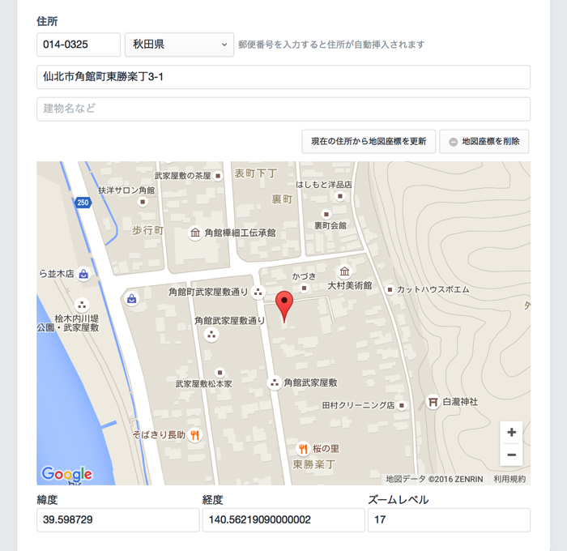

# JP Address plugin for Craft CMS

This plugin is Address FieldType of the Japanese format for Craft CMS.

## Installation

To install JP Address, follow these steps:

1. Download & unzip the file and place the `jpaddress` directory into your `craft/plugins` directory
2.  -OR- do a `git clone https://github.com/dreamseeker/craft-jpaddress.git` directly into your `craft/plugins` folder.  You can then update it with `git pull`
3. Install plugin in the Craft Control Panel under Settings > Plugins
4. The plugin folder should be named `jpaddress` for Craft to see it.  GitHub recently started appending `-master` (the branch name) to the name of the folder for zip file downloads.

JP Address works on Craft 2.6.x.

## JP Address Overview

JP Address adds a 'JP Address' FieldType for Craft CMS that you can add to any of your Sections.

## Configuring JP Address

Create a JP Address field via Settings->Fields.

## Using JP Address

Once you have created the JP Address field, add it to your Section Entry Types, and fill in address information. Each address can contain Google Maps Coordinates.

> [hint] You can change it in Settings->Plugins, if Google Maps Coordinates is unnecessary. `Google Maps API Key` can input in the same screen, too.

## Using JP Address in your Templates

To display information about a jpaddress in your templates, you just use familiar Twig code. If the field handle for your JP Address field is "sampleAddress", this is what you'd use to output information about it.

### Basic Info

* {{ entry.sampleAddress.postalCode }} - Postal code
* {{ entry.sampleAddress.prefecture }} - Name of prefectures
* {{ entry.sampleAddress.cityStreet }} - City name, Street Address
* {{ entry.sampleAddress.building }} - Building name, etc.
* {{ entry.sampleAddress.latitude }} - Latitude for Google Maps
* {{ entry.sampleAddress.longitude }} - Longitude for Google Maps
* {{ entry.sampleAddress.zoomLevel }} - Zoom Level for Google Maps

## JP Address Roadmap

Some things to do, and ideas for potential features:

* For a list of Prefecture

## JP Address Changelog

### 1.0.1 -- 2017.03.11

* Fixed a JavaScript error to occur when you did not use Google Maps Coordinates.
* Update explanations of README.md

### 1.0.0 -- 2016.05.08

* Initial release

Brought to you by [Toru Kokubun](https://github.com/dreamseeker)

## Special Thanks

To automatically insert the address according to the input of the postal code, we use the Ninton G.K.'s library.  
[https://github.com/ninton/jquery.jpostal.js/](https://github.com/ninton/jquery.jpostal.js/)
